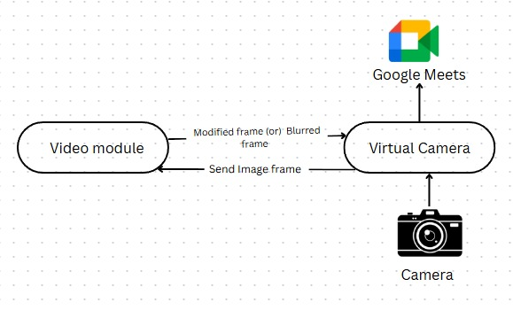

# Clean Meet AI 🚀

🌐 What is Clean Meet AI?

Clean Meet AI is a real-time content safety system for video conferencing. It continuously monitors video, audio, and text streams during online meetings to detect and prevent NSFW visuals, offensive speech, and toxic chat messages.

Works both as a standalone platform and as a plug-and-play integration with major conferencing tools like Zoom, Google Meet, and Microsoft Teams.

Uses deep learning models (computer vision, speech-to-text + toxicity detection, NLP) to analyze multimodal inputs.

Ensures privacy-first processing by handling everything in real-time without storing raw data.

---

  
  
  
  
  
  
  

## ✨ Features

- 🔍 **Standalone Product**  
  - Runs as a dedicated platform.  
  - Monitors all streams (video, audio, text) in real-time.  
  - Flags or blocks inappropriate content.  

- 🔗 **Integration Layer**  
  - Plug & play integration with any video conferencing system (Zoom, Google Meet, MS Teams, etc.).  
  

- ⚡ **Multi-Modal Detection**  
  - **Video:** NSFW or inappropriate visual content.  
  - **Audio:** Offensive language or vulgar speech.  
  - **Text:** Toxic messages in chat.  

- 🔒 **Privacy First**  
  - All processing happens securely.  
  - No unnecessary data storage.  

---

## 🛠️ Tech Stack

- **Backend:** FastAPI (real-time APIs)  
- **Models:** Deep learning (NSFW detection, speech-to-text, toxicity classifiers)  
- **Video Integration:** OBS Virtual Camera / Conferencing APIs  
- **Frontend (Optional):** React-based dashboard for monitoring  

---
