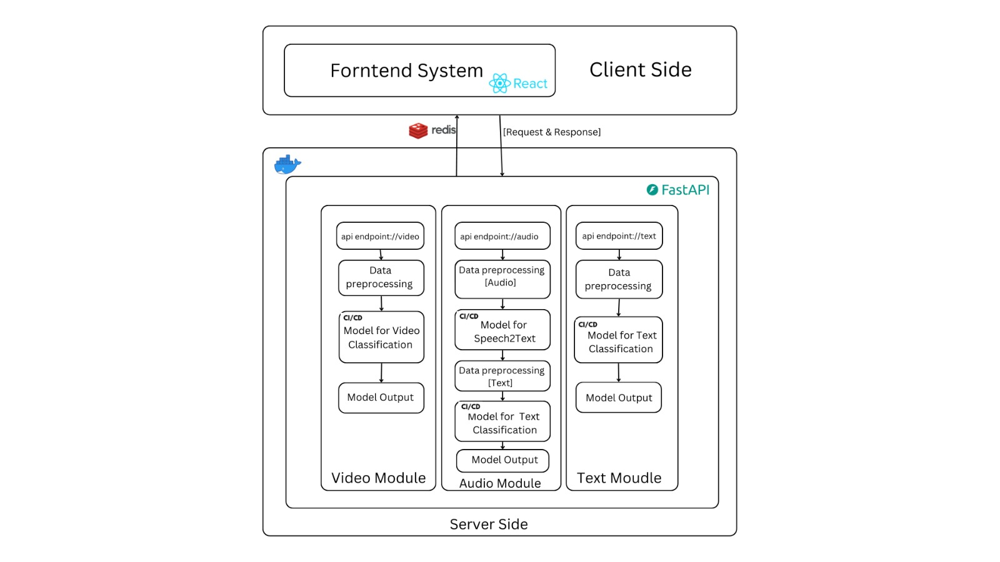
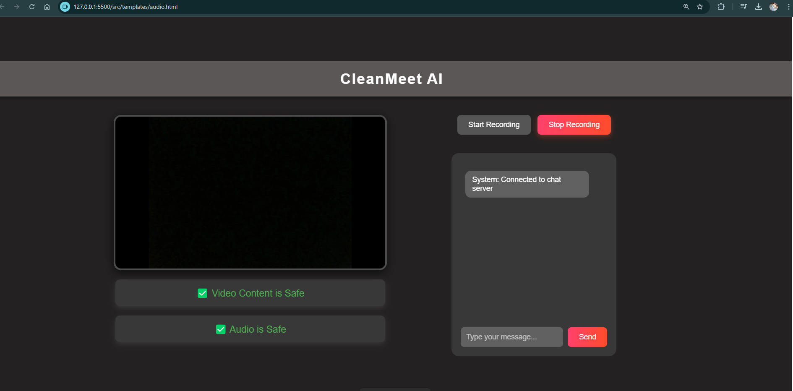
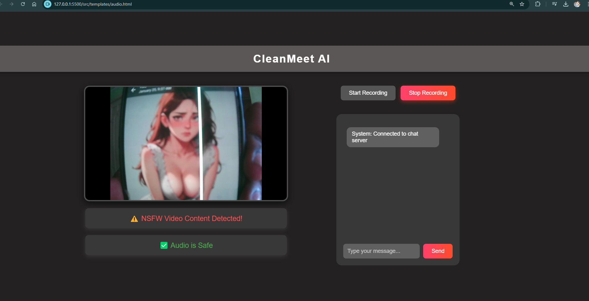
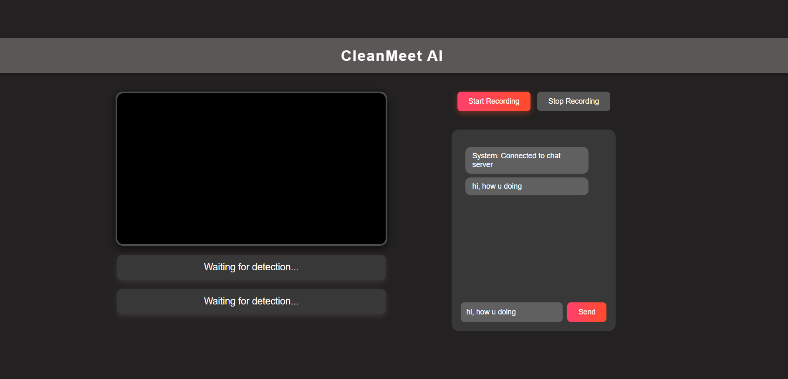
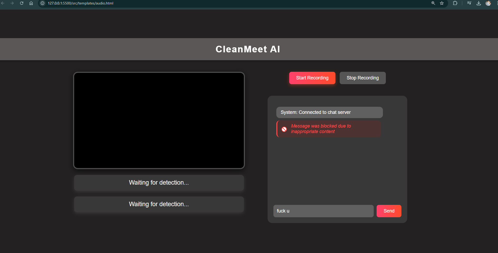
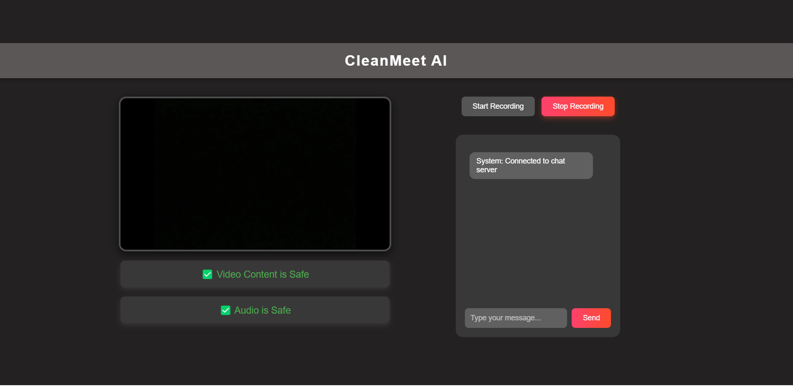
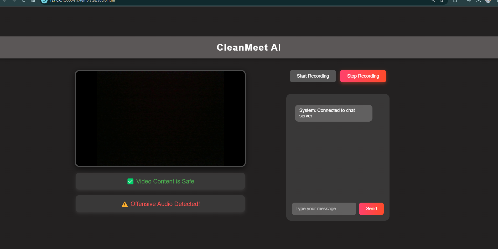

# Clean Meet AI 🚀

**Clean Meet AI** is a real-time content safety system for video conferencing.  
It monitors **video, audio, and text streams** to detect and prevent **NSFW content** or **vulgarity**, ensuring safe and professional online meetings.  

---

## ✨ Features

- 🔍 **Standalone Product**  
  - Runs as a dedicated platform.  
  - Monitors all streams (video, audio, text) in real-time.  
  - Flags or blocks inappropriate content.  

- 🔗 **Integration Layer**  
  - Plug & play integration with any video conferencing system (Zoom, Google Meet, MS Teams, etc.).  
  

- ⚡ **Multi-Modal Detection**  
  - **Video:** NSFW or inappropriate visual content.  
  - **Audio:** Offensive language or vulgar speech.  
  - **Text:** Toxic messages in chat.  

- 🔒 **Privacy First**  
  - All processing happens securely.  
  - No unnecessary data storage.  

---

## 🛠️ Tech Stack

- **Backend:** FastAPI (real-time APIs)  
- **Models:** Deep learning (NSFW detection, speech-to-text, toxicity classifiers)  
- **Video Integration:** OBS Virtual Camera / Conferencing APIs  
- **Frontend (Optional):** React-based dashboard for monitoring  

---
